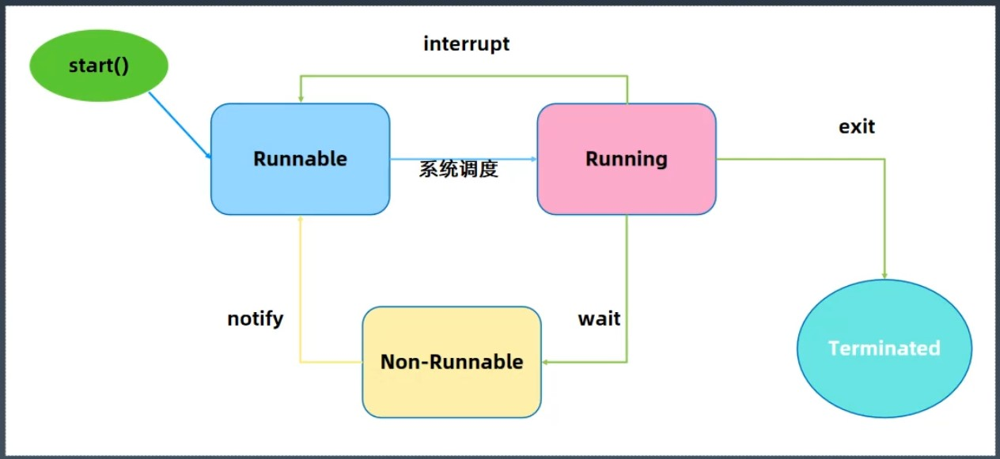

06-Java并发编程
---
1. 为什么会有多线程

硬件发展的太快了，最近20年的CPU主频上不去了，就需要找一堆机器干同一个活，这个就是分布式的根本来源

多核+分布式时代

多CPU核心意味着同时操作系统有更多的并行计算资源可以使用，操作系统以线程作为基本的调度单元。

单线程是最好处理不过的，线程越多，管理复杂度越高。

2. 线程和进程的区别
- 传统的回答
    * 进程是运行中的程序，线程是进程的内部的一个执行序列
    * 进程是资源分配的单元，线程是执行单元
    * 进程间切换代价大，线程间切换代价小
    * 进程拥有资源多，线程拥有资源少
    * 多个线程共享进程的资源
- 在linux系统中，一切皆文件，线程和进程其实没有明显的区别，都对应的是一个文件路径，进程可以有多个子进程。此时多个子进程可以绑定到一个端口上。

3. Java里创建线程的过程(要映射到系统线程)

Thread.start()--JavaThread--OSthread--Stack--TLAB--启动--Thread#run()--终结

run()就是一个普通的方法，只有执行了start()方法之后，才开始执行线程。

4. java线程基础(☆)

- 创建线程的两个办法 
    * new Thread()
    * new Runnable()
- 守护线程 = 守护线程：为所有非守护线程提供服务的线程；换句话说，任何一个守护线程都是整个JVM中所有非守护线程的保姆
```
// 因为设置为守护线程，start()的时候发现没有用户线程，守护线程就直接退出了，不会执行上面的run()方法
public static void main(String[] args) {
    Runnable task =
        new Runnable() {
          @Override
          public void run() {
            try {
              Thread.sleep(2000);
            } catch (InterruptedException e) {
              e.printStackTrace();
            }
            Thread t = Thread.currentThread();
            System.out.println("当前线程：" + t.getName());
          }
        };
    Thread thread = new Thread(task);
    thread.setName("bobook-thread-1");
    thread.setDaemon(true);
    thread.start();
  }
```
- Runnable接口和Thread类
    * Thread实现了Runnable接口
    
- 线程状态

   
   - runnable状态，CPU不忙的时候，可以立即执行
   - Non-Runnable状态，和CPU此时没什么关系，被阻塞了
   
- Thread类(☆)
    * volatile String name;线程名称，诊断分析使用
    * boolean daemon = false;后台守护线程标志-决定JVM优雅关闭
    * Runnable target;任务(智能通过构造函数传入)
    * synchronized void start();【协作】启动新线程并自动执行
    * void join();【协作】等待某个线程执行完毕(来汇合)
    * static native Thread currentThread();静态方法，获取当前线程信息
    * static native void sleep(long millis);静态方法，线程睡眠并让出CPU时间片
- wait & notify
    * void wait();放弃锁+等待0ms+尝试获取锁
    * void wait(long timeout,int nanos);放弃锁+wait+到时间自动唤醒/中途唤醒(精度:nanos>0则timeout++)
    * native void wait(long timeout);放弃锁+wait+到时间自动唤醒/中途被唤醒(唤醒之后需要自动获取锁)
    * native void notify();发送信号通知1个等待线程
    * native void notifyAll();发送信息通知所有等待线程
- Object#wait pk Thread.sleep
    * Thread.sleep:释放CPU
    * Object#wait:释放锁
- Thread的状态改变操作
    * 我睡了-Thread.sleep(long millis),一定是当前线程调用此方法，当前线程进入TIMED_WAITING状态，但不释放对象锁，millis后线程自动苏醒进入就绪状态，作用：给其他线程执行机会的最佳方式
    * Thread.yield(),一定是当前线程调用此方法，当前线程放弃获取的CPU时间片，但不释放锁资源，由运行状态变成就绪状态，让os再次选择。
    * 另一个人加入了-t.join()/t.join(long millis),当前线程里调用其他线程t的join方法，当前线程进入WAITING/TIMED_WAITING状态，当前线程不会释放已经持有的对象锁，线程t执行完毕或者millis时间到，当前线程进入就绪状态。
    * 对象在等我-obj.wait(),当前线程调用对象的wait()方法，当前线程释放对象锁，进入等待队列，依靠notify()/notifyAll()唤醒或者wait(long timeout) timeout时间到自动唤醒。
    * 对象通知我-obj.notify()唤醒在此对象监视器上等待的单个线程，选择是任意性的，notifyAll()唤醒在此对象监视器上的所有等待的线程。  
- Thread的中断和异常处理
    * 线程内部自己处理异常，不溢出到外层
    * 如果线程被Object.wait,Thread.join和Thread.sleep三种方法之一阻塞，此时调用该线程的interrupt()方法，那么线程将抛出一个InterruptedException中断异常(该线程必须实现预备好处理该异常)，从而提早的终结被阻塞状态，如果线程没有被阻塞，这时调用interrupt()将不起作用，直到执行到wait(),sleep(),join()时，才马上会抛出InterruptedException
- 线程的几种状态(RWB)
    * Runnable(等待被Cpu调度)
    * Running(运行中)
    * Waiting(主动的放弃)
    * Timed_Waiting(设置超时，主动放弃，会有一个定时器的东西去操作)
    * Blocked(被动的遇到锁)

5. 线程安全
- 出现线程安全的条件
    * 竞态条件
    * 临界区
    * 共享与同步(进程间通信)
    * 多线程
- 多线程会遇到什么问题
    * 多个线程竞争统一资源时，如果对资源的访问顺序敏感，就称存在竞态条件。
    * 导致竞态条件发生的代码区称为临界区
    * 不进行恰当地控制，就会导致线程安全问题
    
- 并发相关的性质
    * 原子性：原子操作，对基本数据类型的变量的读取和赋值操作是原子性操作，即这些操作是不可被中断的，要么执行，要么不执行。
    * 可见性：
        + 对于可见性，Java提供了valiate关键字解决可见性，它会保证修改的值会立刻被更新到主存，当有其他线程需要读取时，它会去内存中读取新值。---并不能保证原子性。
        + 也可以使用synchronized和Lock保证可见性，synchronized和Lock能保证同一时刻只有一个线程获取锁然后执行同步代码，并且在释放锁之前会对变量的修改刷新到主存之中。
    * 有序性：Java允许编译器和处理器对指令进行重排序，但是重排序过程中不会影响到单线程程序的执行，却会影响到多线程并发执行的正确性。
- happens-before原则(先行发生原则)
- synchronized的实现(☆)
    * 实现机制
        + 使用对象头标记字(Object monitor)
        + Synchronized 方法优化
        + 偏向锁：BiaseLock
    * 使用方法
        + 锁一个方法
        + 锁一个对象
        + 锁一个代码块
- valatile关键字(☆)
    * 每次读取都强制从主存刷数据
    * 使用场景：单个线程写，多个线程读
    * 原则，能不用就不用
    * 替代方法：Atomic原子操作类
- final关键词(☆)
    * final class XXX 不允许继承
    * final 方法：不允许Override
    * final 局部变量；不允许修改
    * final 实例属性：构造函数、初始化块、之后不允许变更 只能赋值一次 安全发布，构造函数结束返回时，final域最新的值被保证对其他线程可见
    * final static 属性：静态块执行后不允许变更，只能赋值一次。

  
