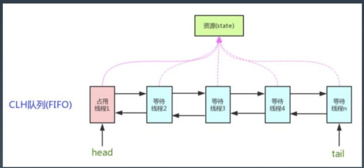
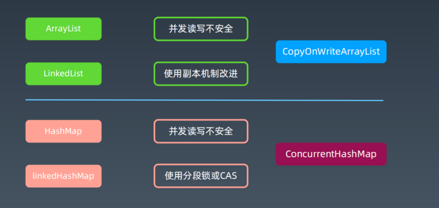

 Java并发编程03-并发工具类、常用集合、并发编程方法及经验
 ---
 
 1. 几种锁
 - 可重入锁
 - 偏向锁
 - 公平锁
 - 读写锁
 
 2. 并发工具类(☆)
 - 为什么需要并发工具类
    * 为了满足更多更复杂的应用场景
    * 需要控制实际并发访问资源的并发数量
    * 需要多个线程在某个时间同时开始运行
    * 需要制定数量线程达到某个状态后进行下一步
 - AQS AbstractQueuedSynchronizer 队列同步器。(☆)
 
 它是构建锁或者其他同步组件的基础（如Semaphore、CountDownLatch、ReentrantLock、ReentrantReadWriteLock），是JUC并发包中的核心基础组件。
  
 
 - Semaphere - 信号量
    * 使用场景：同一时间控制并发线程数
 - CountdownLatch 
    * 场景: Master 线程等待 Worker 线程把任务执行完
    * 示例: 等所有人干完手上的活，一起去吃饭。
 - CyclicBarrier
    * 场景: 任务执行到一定阶段, 等待其他任务对齐。
    * 示例: 等待所有人都到达，再一起开吃。
 - Future/FutureTask/CompletableFuture
    * Future的核心思想是：一个方法，计算过程可能非常耗时，等待方法返回，显然不明智。可以在调用方法的时候，立马返回一个Future，可以通过Future这个数据结构去控制方法f的计算过程。
        + get方法：获取计算结果（如果还没计算完，也是必须等待的）这个方法会产生阻塞，会一直等到任务执行完毕才返回；
        + get(long timeout, TimeUnit unit)用来获取执行结果，如果在指定时间内，还没获取到结果，就直接返回null。
        + cancel方法：还没计算完，可以取消计算过程，如果取消任务成功则返回true，如果取消任务失败则返回false。参数mayInterruptIfRunning表示是否允许取消正在执行却没有执行完毕的任务，如果设置true，则表示可以取消正在执行过程中的任务。如果任务已经完成，则无论mayInterruptIfRunning为true还是false，此方法肯定返回false，即如果取消已经完成的任务会返回false；如果任务正在执行，若mayInterruptIfRunning设置为true，则返回true，若mayInterruptIfRunning设置为false，则返回false；如果任务还没有执行，则无论mayInterruptIfRunning为true还是false，肯定返回true。
        + isDone方法：判断是否计算完
        + isCancelled方法：判断计算是否被取消，方法表示任务是否被取消成功，如果在任务正常完成前被取消成功，则返回 true。 
    * FutureTask继承体系中的核心接口是Future。事实上，FutureTask是Future接口的一个唯一实现类。
    * CompletableFuture JDK1.8才新加入的一个实现类，实现了Future<T>, CompletionStage<T>2个接口
 
 3. 线程安全的集合类
 - 常见线程安全类型
    * 线性的数据结构-都来源于Collection接口，并且拥有迭代器
        + List：ArrayList LinkedList Vector Stack
        + Set：LinkedSet HashSet TreeSet
        + Queue: Queue Deque LinkedList
    * map类的数据结构
        + HashMap linkedHashMap TreeMap
        + Dictionary(类似于Map的一个接口) HashTable Properties
    * 原生类型、数组类型、应用类型
 - ArrayList(☆)
    * 基本特点：基于数组，便于按 index 访问，超过数组需要扩容，扩容成本较高
    * 用途：大部分情况下操作一组数据都可以用 ArrayList
    * 原理：使用数组模拟列表，默认大小10，扩容 x1.5，newCapacity = oldCapacity + (oldCapacity >> 1)
    * 安全问题：
        + 写冲突：
          - 两个写，相互操作冲突
        + 读写冲突：
          - 读，特别是 iterator 的时候，数据个数变了，拿到了非预期数据或者报错
          - 产生ConcurrentModificationException
 - linkedList(☆)
    * 基本特点：使用链表实现，无需扩容
    * 用途：不知道容量，插入变动多的情况
    * 原理：使用双向指针将所有节点连起来
    * 安全问题：
        + 写冲突：
          - 两个写，相互操作冲突
        + 读写冲突：
          - 读，特别是 iterator 的时候，数据个数变了，拿到了非预期数据或者报错
          - 产生ConcurrentModificationException
 - List线程安全的简单办法
    * 既然线程安全是写冲突和读写冲突导致的最简单办法就是，读写都加锁。
        + ArrayList 的方法都加上 synchronized -> Vector
        + Collections.synchronizedList，强制将 List 的操作加上同步
        + Arrays.asList，不允许添加删除，但是可以 set 替换元素
        + Collections.unmodifiableList，不允许修改内容，包括添加删除和 set
 - CopyOnWriteArrayList-读写分离，最终一致(☆)
    * 写加锁，保证不会写混乱
    * 写在一个 Copy 副本上，而不是原始数据上（GC young 区用复制，old 区用本区内的移动）
 - HashMap
    * 基本特点：空间换时间，哈希冲突不大的情况下查找数据性能很高
    * 用途：存放指定 key 的对象，缓存对象
    * 原理：使用 hash 原理，存 k-v 数据，初始容量16，扩容 x2，负载因子0.75
    * JDK8 以后，在链表长度到8 & 数组长度到64时，使用红黑树。
    * 安全问题：
        + 写冲突
        + 读写问题，可能会死循环
        + keys()无序问题
 - LinkedHashMap
    * 基本特点：继承自HashMap，对 Entry 集合添加了一个双向链表
    * 用途：保证有序，特别是 Java8 stream 操作的 toMap 时使用
    * 原理：同LinkedList，包括插入顺序和访问顺序    
    * 安全问题：
      + 写冲突
      + 读写问题，可能会死循环
      + keys()无序问题
 - ConcurrentHashMap(☆)
    * Java7 
        + 分段锁:默认16个Segment，降低锁粒度。concurrentLevel = 16
        + 相当于分库分表，可以单独对每个Segment进行加锁
        + 根据哈希码高sshift位决定Segment数组的index
        + 根据哈希码决定HashEntry数组的index
    + Java8
        + Java 7为实现并行访问，引入了Segment 这一结构，实现了分段锁，理论上最大并发度与 Segment 个数相等。    
        + Java 8为进一步提高并发性，摒弃了分段锁的方案，而是直接使用一个大的数组。
 - 总结 
     
 
4. 并发编程相关内容
 - 线程安全操作利器 - ThreadLocal(☆)     
    * 线程本地变量
    * 场景: 每个线程一个副本
    * 不改方法签名静默传参
    * 及时进行清理  
         
 重要方法  |  说明  
 ----- |----  
 public ThreadLocal()  | 构造方法
 protected T initialValue() | 覆写-设置初始默认值
 void set(T value) | 设置本线程对应的值
 void remove() | 清理本线程对应的值
 T get() | 获取本线程对应的值
 
 - 四两拨千斤 - 并行 Stream
    * 多线程执行，只需要加个 parallel 即可
 - 伪并发问题
    * 跟并发冲突问题类似的场景很多
    * 比如浏览器端，表单的重复提交问题
    * 1、客户端控制（调用方），点击后按钮不可用，跳转到其他页
    * 2、服务器端控制（处理端），给每个表单生成一个编号，提交时判断重复   
 
 5. 并发编程经验总结
 - 加锁需要考虑的问题
    * 粒度
    * 性能
    * 重入
    * 公平
    * 自旋锁（spinlock）
    * 场景: 脱离业务场景谈性能都是耍流氓         
 - 线程间协作与通信
    * 线程间共享: 
        + static/实例变量(堆内存) 
        + Lock
        + synchronized
    * 线程间协作: 
        + Thread#join()
        + Object#wait/notify/notifyAll
        + Future/Callable
        + CountdownLatch
        + CyclicBarrier 
    * 进程间协作
        + 信号
        + 管道 netstat -ano | findstr LIST
        + 共享内存
        + 文件
        + socket
        + 自定义网络协议头
        + 数据库
        + redis 
        + mq      
 6. 参考链接
 - [多线程并发执行任务，取结果归集。终极总结：Future、FutureTask、CompletionService、CompletableFuture](https://www.cnblogs.com/dennyzhangdd/p/7010972.html)