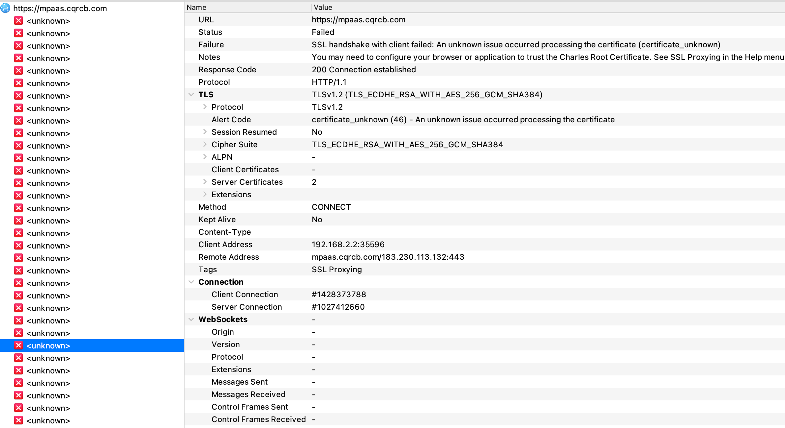

 - 简介
    - Charles 是在 Mac 下常用的网络封包截取工具，在做 移动开发时，我们为了调试与服务器端的网络通讯协议，常常需要截取网络封包来分析。
    - Charles 通过将自己设置成系统的网络访问代理服务器，使得所有的网络访问请求都通过它来完成，从而实现了网络封包的截取和分析。
    - 截取 Http 和 Https 网络封包。
    - 支持重发网络请求，方便后端调试。
    - 支持修改网络请求参数。
    - 支持网络请求的截获并动态修改。
    - 支持模拟慢速网络。   
 - 下载及安装
    - [参考官方网站](https://www.charlesproxy.com/)
 - 配置
    - 1、 打开charles ---> help---> register。
    - 2、输入Registered Name: https://zhile.io 、 License Key: 48891cf209c6d32bf4。
 - 视图
    - tructure/结构视图，将网络请求按访问的域名分类，比如某个域名下有n个资源请求，那么所有此域名下的请求都会在这里做一个详细的分类；
    - Sequence/序列视图，将网络请求按访问的时间排序，按照你的电脑的发送请求顺序进行。有时候请求多了会看不过来，Charles 提供了一个简单的 Filter 功能，可以输入关键字来快速筛选出 URL 中带指定关键字的网络请求。  
 - Android7.0以上配置证书的问题
   - Android高版本配置完之后，会出现如下错误，需要安装包增加权限配置或者root手机修改配置解决
   
   - [Charles 在 Android 7.0 上会 SSL handshake failed](https://zhuanlan.zhihu.com/p/48255523)   
 - 参考链接
    - [Mac环境下使用charles进行https抓包分析](https://blog.csdn.net/samuelandkevin/article/details/95767434)
    - [mac下charles使用简介](https://www.jianshu.com/p/82f63277d50f)
    - [Charles-Mac安装、配置及苹果手机安装证书](https://www.cnblogs.com/lilyo/p/11947625.html)